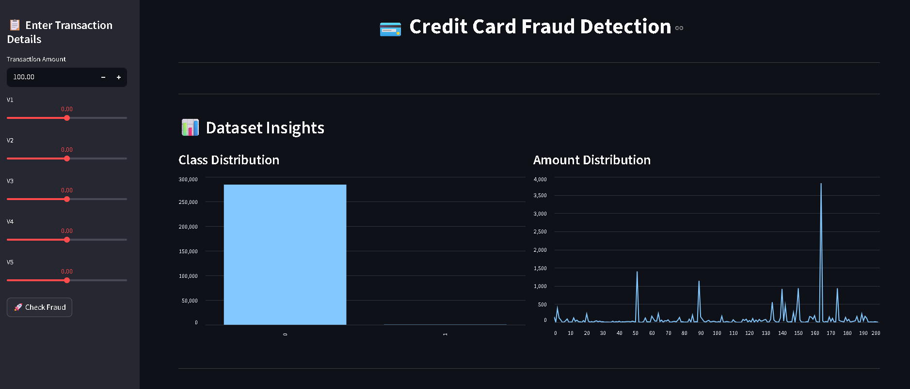
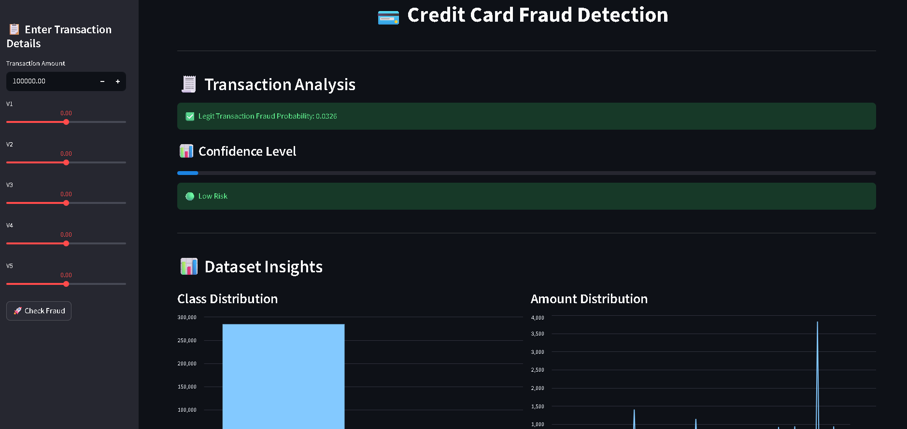
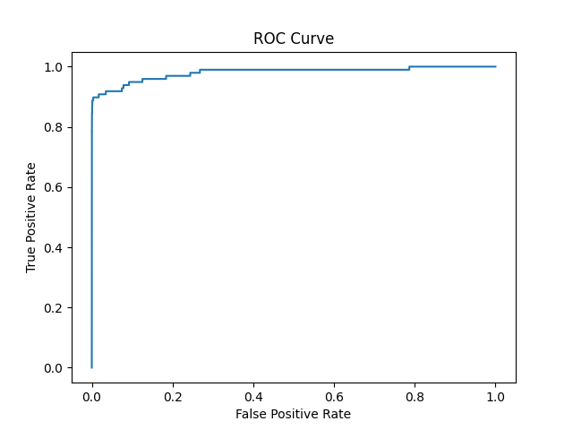
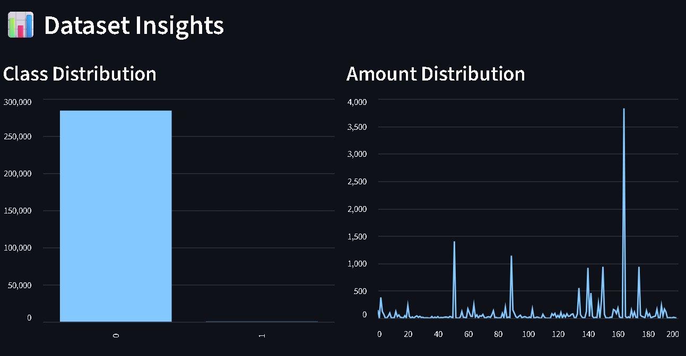

# 💳 Credit Card Fraud Detection System

🔗 **Live App:**  
👉 https://credit-card-fraud-detection-gvixeq5apnvwhhmoh3sy4d.streamlit.app/

📂 **GitHub Repository:**  
👉 https://github.com/Vayu-143/credit-card-fraud-detection

---

## 📌 Overview

This project is an end-to-end Machine Learning application designed to detect fraudulent credit card transactions in real time.

Credit card fraud is a major global issue, costing billions annually, and requires intelligent systems to identify suspicious patterns quickly.

This application uses a Random Forest Classifier trained on highly imbalanced transaction data to predict whether a transaction is fraudulent or legitimate.

---

## 🚀 Features

✔ Real-time fraud prediction  
✔ Interactive Streamlit dashboard  
✔ Confidence score visualization  
✔ Risk level classification (Low / Medium / High)  
✔ Dataset insights (Class & Amount distribution)  
✔ ROC Curve visualization  
✔ Feature importance analysis  
✔ Clean modular ML pipeline (production-style)

---

## 🧠 How It Works

- The model is trained on anonymized transaction data with features:
  - Time, Amount, and PCA-transformed features (V1–V28)
- Fraud detection is treated as a binary classification problem  
- Uses Random Forest with class balancing to handle imbalanced data  
- Predicts probability of fraud using:

```python
model.predict_proba()
```

👉 Fraud detection systems rely on identifying unusual transaction patterns rather than fixed rules

---

## 📊 Model Performance

| Metric | Score |
|------|------|
| Precision (Fraud) | 0.81 |
| Recall (Fraud) | 0.82 |
| F1-score | 0.81 |

👉 Focus is on recall (catching fraud) while maintaining good precision.

---

## 📈 Visualizations

- 📊 Class imbalance visualization  
- 💰 Transaction amount trends  
- 📉 ROC Curve for model evaluation  
- 🔍 Feature importance graph  

---

## 🏗️ Project Structure

```
credit-card-fraud-detection/
│
├── src/
│   ├── app.py              # Streamlit frontend
│   ├── data_loader.py      # Data loading
│   ├── preprocessing.py    # Feature engineering
│   ├── model.py            # Model loading
│   ├── evaluate.py         # Metrics
│   ├── visualize.py        # Graphs
│
├── models/
│   ├── fraud_model.pkl
│   ├── scaler.pkl
│
├── images/
│   ├── roc.png
│
├── requirements.txt
├── README.md
```

---

## ⚙️ Tech Stack

- Python 🐍  
- Scikit-learn 🤖  
- Streamlit 🌐  
- Pandas & NumPy 📊  
- Matplotlib 📈  
- Joblib 💾  

---

## 📥 Installation

Clone the repository:

```bash
git clone https://github.com/Vayu-143/credit-card-fraud-detection.git
cd credit-card-fraud-detection
```

Install dependencies:

```bash
pip install -r requirements.txt
```

Run the app:

```bash
streamlit run src/app.py
```

---

## 🌍 Deployment

This app is deployed using Streamlit Cloud.

Steps to deploy:

1. Push code to GitHub  
2. Go to https://share.streamlit.io  
3. Connect your GitHub repo  
4. Select:
   ```
   src/app.py
   ```
5. Click **Deploy**

---

## 📊 Dataset

- Source: ULB Machine Learning Group (Kaggle dataset)  
- Contains anonymized credit card transactions  
- Highly imbalanced (~0.17% fraud cases)

👉 Imbalanced datasets make fraud detection more challenging and require specialized techniques.

---

## ⚠️ Challenges

- Imbalanced data  
- Fraud patterns constantly evolving  
- False positives vs false negatives trade-off  
- Real-time prediction requirements  

---

## 🔮 Future Improvements

- Add Deep Learning models (LSTM / Autoencoder)  
- Deploy with FastAPI backend  
- Add user authentication  
- Real-time streaming fraud detection  
- Explainability (SHAP / LIME)  

---

## 📸 Screenshots

### App Interface


### Prediction Result


### ROC Curve


### Dataset Insights


---

## 👨‍💻 Author

**Vayunandan Mishra**  
GitHub: https://github.com/Vayu-143  

---

## 📌 Project Highlights

- Built end-to-end ML system for fraud detection  
- Deployed real-time prediction web app  
- Handled imbalanced dataset using advanced techniques  
- Integrated visualization + model explainability  

---

## ⭐ If You Like This Project

Give it a ⭐ on GitHub — it helps a lot!